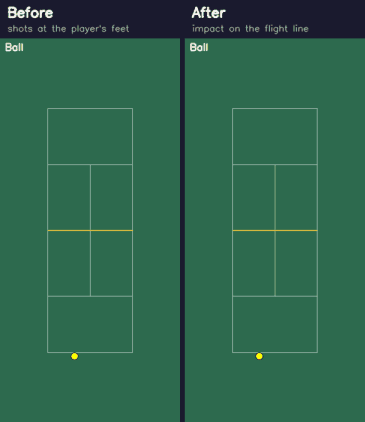
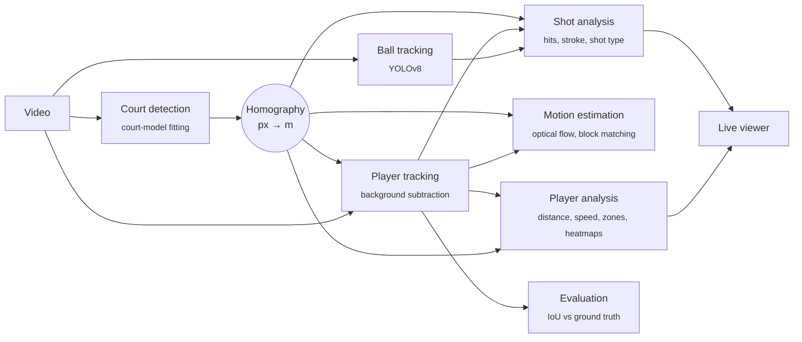

# Tennis Players Tracking

[](https://github.com/marcomassa-unitn/tennis_players_tracking/actions/workflows/ci.yml)


[](LICENSE)

**Turn a single, uncalibrated broadcast tennis clip into structured match data:**
court geometry, metric player trajectories, movement statistics, the ball track,
its bounces and a shot-by-shot breakdown (forehand/backhand, flat/slice/dropshot/lob/volley,
serve/smash).

The core is **classical computer vision**. Court detection, player tracking, motion
estimation and shot reasoning are training-free and interpretable. The ball is
the one exception: it is small and fast, so it uses a YOLOv8 detector.

<p align="center">
  
</p>

## Highlights

- **Court reconstruction without training.** The full ITF court model,
  including the doubles alleys, is fitted to the white line markings. Each
  candidate homography is scored by how much of the *whole* court it puts on
  line pixels, so banners, net and writing next to the court are rejected. The
  same settings work on five clips from three tournaments, and the fitted
  lines land within about 1 px of the painted ones.
- **One homography, metric everything.** A single RANSAC homography maps pixels
  to court metres, so positions, distances, speeds (km/h) and zone occupancy are
  all physical quantities.
- **Two-player tracking that does not depend on how the clip starts.** The
  background is the median of frames spread over the whole clip, so a player
  standing still to serve is still detected, and fade-ins from black do not
  matter. Identities come from the court half (through the homography), so a
  player who is lost comes back as soon as they are visible again. The camera
  tilting or panning a few pixels is compensated by phase correlation. Camera
  shake, cast shadows and on-screen TV graphics are filtered out. Both players
  are found on 95–100 % of the frames of all six test clips.
- **Ball tracking measured against hand-labelled positions.** A fine-tuned
  YOLOv8x runs on full-resolution tiles, and the ball is chosen as the best
  physically plausible path through the candidates. Against hand-labelled ball
  positions, recall rises from 0.64 to 0.92 with no false positives, and the
  centre error falls from 2.0 px to 1.2 px. On a second clip, recall goes
  from 0.72 to 0.91.
- **Shot types from the ball's physics.** Bounces are found to within a fraction
  of a frame, and the flight to the bounce gives each shot's type: its duration,
  landing point and height work the same at both ends of the court. It agrees with
  all 23 shots of a hand-labelled rally (flat, slice, dropshot, lob), and volleys
  are told by the missing bounce.
  Every contact is also classified as forehand or backhand; in the hitmap the
  colour gives the type of shot and the letter (F, B) its side.
- **Classical motion estimation, implemented from scratch.** Full-search and
  three-step block matching (SAD), next to Farnebäck and Lucas–Kanade optical
  flow.
- **Engineered as a pipeline.** It runs with one command, headless, and each
  stage is isolated so one failure doesn't stop the rest. Stages pass data
  through a stable CSV contract. It also ships an annotation tool, IoU-based
  evaluation against manual ground truth, unit tests and CI.

## Results on the demo rally

The demo clip (`data/Input_video2.mp4`) is 1008 frames at 30 fps, 1080p. On it
the pipeline produces:

| Stage | Result |
|---|---|
| Court | 98 % of the court model on detected line pixels; fitted lines within ≈1 px of the painted ones |
| Players | both players detected on 100 % of the frames, identities fixed by court half |
| Ball | found on 91 % of the frames (original detector: 60 %); vs hand-labelled positions: precision 1.00, recall 0.92, centre error 1.2 px |
| Movement | near player 94.8 m covered (mean 10.6 km/h, p95 29.6 km/h); far player 104.2 m (mean 11.8 km/h, p95 27.4 km/h) |
| Shots | 25 contacts detected (13 near player, 12 far player), opening serve identified as a serve |
| Bounces | vs 25 hand-labelled bounces: precision 1.00, recall 0.96, median time error 0.2 frames, median landing error 0.23 m; on a second clip (14 bounces) 1.00, 1.00, 0.2 frames, 0.12 m |
| Shot mix | 17 flat, 4 slice, 3 dropshot, 1 lob; 16 backhands, 7 forehands, 2 on the body axis (the serve included) |
| Shot type | **23/23** against a hand-labelled ground truth (`--type-self-test`)¹ |
| Self-tests | synthetic stroke test 4/4, synthetic serve/smash test 5/5 with zero false positives |

¹ The three flight thresholds were chosen looking at this same rally, so 23/23
shows the rules fit the labelled data. It is not an accuracy figure on unseen
footage. On the other clips there are no labels: the 1.05 s split falls in a gap
(1.04–1.10 s) that holds on all five clips, and the lobs found there were checked
by eye. The report's 21/23 is a different result, from an earlier version of the
classifier.

| Combined position heatmap | Court-zone occupancy | Shot hitmap |
|:---:|:---:|:---:|
|  |  |  |

<p align="center">
  
  
  <br><em>Left: fitted court model (yellow) and the 8 keypoints (red). Right: dense optical flow (hue = direction, brightness = magnitude).</em>
</p>

<p align="center">
  
  <br><em>Seen from above, a bounce does not turn the ball. Left: with shots placed at the player's feet, the path bends at every bounce, by an arm and a racket. Right: with impacts placed on the flight line, it runs straight. Those impacts also tell forehand from backhand on the court.</em>
</p>

## How it works


```mermaid
flowchart LR
    V[Video] --> C[Court detection<br/><sub>court-model fitting</sub>]
    V --> P[Player tracking<br/><sub>background subtraction</sub>]
    V --> B[Ball tracking<br/><sub>YOLOv8</sub>]
    C --> H((Homography<br/>px → m))
    H --> P
    H --> PA[Player analysis<br/><sub>distance, speed, zones, heatmaps</sub>]
    P --> PA
    P --> M[Motion estimation<br/><sub>optical flow, block matching</sub>]
    H --> M
    B --> S[Shot analysis<br/><sub>hits, stroke, shot type</sub>]
    P --> S
    H --> S
    P --> E[Evaluation<br/><sub>IoU vs ground truth</sub>]
    PA --> L[Live viewer]
    S --> L
```

1. **Court detection** ([`tracking/court_tracking.py`](tracking/court_tracking.py)).
   Line pixels are pixels brighter than their neighbours a few pixels away,
   which keeps thin, dim lines and drops large bright areas. A Hough transform
   gives candidate lines. Every pair of horizontal and pair of oblique
   candidates, matched to the court model's lines, defines a homography. It is
   scored by projecting the whole model, doubles alleys included, onto the line
   pixels. The best hypothesis is refined by refitting every line on its own
   pixels. Several frames are tried, which handles fade-ins and occlusions.
   The run fails, rather than saving wrong keypoints, if no frame matches the
   model well enough. An overlay image is saved next to the CSV to check the
   result.
2. **Player tracking** ([`tracking/player_tracking.py`](tracking/player_tracking.py)).
   The background is the per-pixel median of about 40 frames spread over the
   whole clip, leaving out black or fade-in frames, and aligned to each other.
   Each frame is first realigned to it, because a broadcast camera can tilt or
   pan a few pixels during a clip; the shift is measured by phase correlation.
   The frame is then gain-matched and compared with the background's local
   min/max over a few pixels, so the slight shake of broadcast cameras does not
   light up the court lines. While the camera is shifted, the court lines
   themselves are masked, and thin horizontal strips are removed from blobs.
   Cast
   shadows are removed, and so are on-screen graphics, which stay pixel-identical
   from frame to frame. Fragments of the same person are merged, and blobs are
   kept only if their feet stand in the walkable area of the court. P1 is the
   player in the near half, P2 the one in the far half. A player seen recently
   is followed by proximity; otherwise the largest plausible blob in that half
   is taken. Gaps up to 0.5 s are interpolated and flagged in an `interpolated`
   column.
3. **Player analysis** ([`analysis/player_analysis.py`](analysis/player_analysis.py)).
   The feet point of each box is projected to metres. From it the stage computes
   distance covered, mean, median, p95 and max speed (with a physiological 45 km/h
   glitch filter), occupancy of a 6×4 zone grid over the walkable area,
   Gaussian-smoothed heatmaps and an animated top-down minimap.
4. **Motion estimation** ([`motion_estimation/`](motion_estimation)).
   Dense Farnebäck flow inside each player box is converted to km/h and compared
   with positional speed. Lucas–Kanade tracks Shi–Tomasi corners. Block matching
   is written from scratch: full search and three-step search, with
   motion-compensated PSNR against a no-motion baseline.
5. **Ball tracking** ([`tracking/ball_tracking.py`](tracking/ball_tracking.py)).
   Two stages. **Detection:** a fine-tuned YOLOv8x runs on 640 px tiles of the
   frame at native resolution, plus the whole frame. On the whole frame alone
   the ~15 px ball would shrink to ~5 px. Every candidate is kept with its
   confidence, its source and how much it moved since the previous frame.
   **Tracking:** still candidates (balls held by ball kids) are discarded. The
   ball is then the best path through the remaining candidates over the whole
   clip, found by dynamic programming. Confident candidates earn points, while
   links cost in proportion to the implied speed and the frames skipped, and
   impossible speeds are forbidden. Knowing the frames after a racket hit, the
   path picks the right candidate where a frame-by-frame filter would not.
   One-frame spikes are removed, and gaps up to 0.33 s are filled with a
   shape-preserving cubic and flagged. Detection needs a GPU and runs in the
   [Colab notebook](notebooks/ball_tracking_colab.ipynb). Its candidates CSV is
   reused, so tracking runs on any laptop.

   | Ball vs hand-labelled positions | Precision | Recall | Centre error |
   |---|---|---|---|
   | Original detector (whole frame only), Input_video2 | 1.00 | 0.64 | 2.0 px |
   | **Current**, Input_video2 (101 labelled frames) | **1.00** | **0.92** | **1.2 px** |
   | Original detector, input_video | 0.97 | 0.72 | 2.1 px |
   | **Current**, input_video (43 frames) | **0.95** | **0.91** | **1.3 px** |

   On the other test clips, the share of frames with a real detection rises from
   44–48 % to 82–87 %.
6. **Shot analysis** ([`analysis/shot_analysis.py`](analysis/shot_analysis.py)).
   Contacts are detected from persistent reversals of the vertical velocity and
   from acceleration peaks on the Savitzky–Golay-smoothed ball track, and are
   kept only when the ball is near a player. That rejects most bounces, and the
   ones left, right in front of the receiver, are moved to the hit that follows
   them using the events of the next step. The stroke
   (forehand/backhand) comes from the ball's side relative to the body axis,
   taking handedness and court side into account. The shot type comes from the
   flight to the bounce of the next step: a flight under 1.05 s is flat; a slower
   ball is a dropshot if it lands within 4.5 m of the net, a lob if it flies above
   2 m, and a slice if it floats lower. The height is the ball's distance in the
   image from the point below it on the court. A shot played from inside the
   court with no bounce since the opponent's shot, with the ball coming and going
   back, is a volley. Shots with no bounce found fall back
   on perspective-invariant features of the outgoing trajectory. Serves are found
   from the server's motion rather than from the ball: a player standing at their
   own baseline, after a quiet spell with no opponent shot, whose box (in metres
   at the feet) stays raised by the toss and racket and then peaks at contact.
   The last peak is taken as the contact, so neither the toss release nor a gap
   in the ball track is mistaken for it. The serve is placed where the server stood
   before jumping, since feet in the air project to the wrong spot on the court.
   Smashes are often hit out of sight, the ball of a high lob having left the
   picture, so they are also found from the motion: the arm-up of a serve from inside
   the court, followed by the ball leaving the striker's side and crossing the net.
   Both go in a separate, conservative overhead column.
7. **Bounce detection** ([`analysis/bounce_detection.py`](analysis/bounce_detection.py)).
   Between two events the ball flies freely, so in the image it follows almost a
   parabola. The real detections are split into the best sequence of parabolas by
   dynamic programming, and the point where two of them meet gives the time, between
   frames if needed, and the landing point. Physics then filters the junctions: the
   ground only pushes the ball up the image (typically a jump of 9–13 m/s here, at
   both ends of the court once scaled to metres), and a bounce lies on the court,
   where the homography is exact. The order of a rally (hit, bounce on the other side,
   hit, …) picks the final labels, which is what separates a near bounce from the
   near hit that follows it. Pipeline step 6 runs this first, then the shots.
   Seen from above, a bounce does not turn the ball, so the previous impact, the bounce
   and the next impact lie on one line. The player's feet are about 0.85 m off it, an
   arm and a racket away, so the impact is taken on the line, unless the player is out
   of reach of it. The side of the impact then gives forehand or backhand on the court,
   and the two methods agree on 92 of the 97 shots where both apply; the five that
   differ were checked by eye, and the image-based rule was the wrong one in four.
8. **Evaluation** ([`evaluation/`](evaluation)). A small OpenCV tool annotates
   ground-truth boxes and court keypoints. The evaluator reports mean and median
   IoU, precision and recall at IoU 0.5, centre error (px), feet error (m), ID
   switches and per-keypoint court error.

The [**live viewer**](live_view.py) replays the clip with player and ball boxes,
a synced minimap, a running shot tally and a court following the ball, with its
bounces numbered as they happen. The ball moves there on its path over the ground,
from each contact to each bounce, since an airborne ball cannot be projected. At the end it shows the whole-clip
heatmap, zones and shot hitmap.

## Quick start

```bash
git clone https://github.com/marcomassa-unitn/tennis_players_tracking.git
cd tennis_players_tracking
python -m venv .venv && source .venv/bin/activate   # Windows: .venv\Scripts\activate
pip install -r requirements.txt
```

**Optional: ball tracking.** Ball detection runs a large YOLO model, best on a
GPU. Download the trained weights from the
[latest release](https://github.com/marcomassa-unitn/tennis_players_tracking/releases/latest).
Then do one of the following:

- run [`notebooks/ball_tracking_colab.ipynb`](notebooks/ball_tracking_colab.ipynb)
  on a free Colab GPU, or [`notebooks/ball_tracking_kaggle.ipynb`](notebooks/ball_tracking_kaggle.ipynb)
  on Kaggle, where a saved version keeps running with the computer off. Then put the
  resulting `ball_candidates_<clip>.csv` in `outputs/<clip>/ball_coordinates/`;
- or, with a GPU, put the weights in `models/ball_tracker.pt` and run
  `pip install ultralytics`.

Run the whole pipeline on the demo clip. It's headless and writes everything to
the clip's own folder, `outputs/Input_video2/`:

```bash
python pipeline.py --video data/Input_video2.mp4
```

It lists which steps already have results and asks which ones to redo; the rest
is reused. Redoing a step also offers to redo the steps that read its results.
Without a terminal, only the missing steps run. Every clip keeps its own results,
so the viewers open any processed clip without running anything again.

Then watch the result:

```bash
python live_view.py --video data/Input_video2.mp4      # space: pause, n: next frame, q: quit
```

If the weights are missing, ball tracking and shot analysis are skipped cleanly
and the other stages still run. To use your own clip, put it in `data/` and
change `--video`. Every intermediate file is named after the video, so no other
paths need editing.

<details>
<summary><b>Running individual stages</b></summary>

```bash
# 1. Tracking: produces the CSVs everything else reads
python tracking/court_tracking.py  --video data/Input_video2.mp4 --no-display
python tracking/player_tracking.py --video data/Input_video2.mp4 --no-display
python display_player_tracking.py  --video data/Input_video2.mp4   # watch the tracker's stages (saves nothing)
python tracking/ball_tracking.py   --video data/Input_video2.mp4 --detect-only   # GPU: YOLO candidates
python tracking/ball_tracking.py   --video data/Input_video2.mp4 \
    --candidates outputs/Input_video2/ball_coordinates/ball_candidates_Input_video2.csv     # CPU: tracking

# Check the court keypoints: draws them and the reprojected court model on a frame
# (court_tracking.py also saves this image next to the court CSV)
python utils/court_overlay.py --video data/Input_video2.mp4

# 2. Analysis
python analysis/player_analysis.py --video data/Input_video2.mp4 [--no-animation]
python analysis/shot_analysis.py   --video data/Input_video2.mp4 --p1-hand right --p2-hand right

# 3. Motion estimation
python motion_estimation/optical_flow.py   --frames 200
python motion_estimation/block_matching.py --method both

# 4. Ground truth and evaluation
python evaluation/annotate.py boxes --video data/Input_video2.mp4 --step 30
python evaluation/annotate.py court --video data/Input_video2.mp4
python evaluation/annotate.py ball  --video data/Input_video2.mp4 --step 10   # click the ball, n = not visible
python evaluation/annotate.py bounce --video data/Input_video2.mp4   # a/d move, click + ENTER = bounce, h = hidden
python evaluation/evaluate_tracking.py --gt <gt_boxes.csv> \
    --pred outputs/Input_video2/player_coordinates/players_Input_video2.csv \
    --court outputs/Input_video2/court_coordinates/Input_video2_court.csv \
    --court-gt <gt_court.csv>
python evaluation/evaluate_tracking.py --ball-gt ground_truth/ball_Input_video2_gt.csv \
    --ball-pred outputs/Input_video2/ball_coordinates/ball_Input_video2.csv
python evaluation/evaluate_tracking.py --video data/Input_video2.mp4     --bounce-gt ground_truth/bounce_Input_video2_gt.csv     --court outputs/Input_video2/court_coordinates/Input_video2_court.csv
```

Useful `pipeline.py` flags:

- `--display` shows the OpenCV windows.
- `--redo 2,6`, `--redo shots`, `--redo all`, `--redo missing` choose the steps
  to redo without asking.
- `--skip-court`, `--skip-tracking`, … skip single steps, also without asking.
- `--flow-frames N` caps the dense optical flow at N frames.
- `--gt-csv` / `--court-gt-csv` enable the evaluation stage.

Every script supports `--help`.

The shot-type thresholds are exposed as CLI flags (`--far-peak-m`,
`--drop-diefrac`, `--lob-pace`, …) and can be checked with the built-in
self-tests:

```bash
python analysis/shot_analysis.py --self-test           # synthetic strokes
python analysis/shot_analysis.py --overhead-self-test  # synthetic serve/smash
python analysis/shot_analysis.py --type-self-test      # labelled demo rally (needs the ball CSV)
```

</details>

## Project structure

```
├── pipeline.py              # one-command runner for all stages
├── live_view.py             # replay with overlays, minimap and live stats
├── display_player_tracking.py  # player tracker's stages side by side, for inspection
├── tracking/                # court keypoints, player tracker, YOLO ball tracker
├── analysis/                # player statistics and shot detection/classification
├── motion_estimation/       # Farnebäck / Lucas–Kanade, block matching from scratch
├── evaluation/              # annotation tool and tracking metrics
├── ground_truth/            # hand-made annotations used by the evaluation
├── utils/                   # court geometry (ITF), pixel→metre homography, paths, video helpers
├── tests/                   # pytest suite (run in CI)
├── notebooks/               # Colab and Kaggle notebooks to run ball detection on a GPU
├── docs/                    # report (PDF + LaTeX) and presentation
├── data/                    # demo clip
├── models/                  # put ball_tracker.pt here
└── outputs/<clip>/          # all the results of a clip, one folder per kind (not in git)
```

## Development

```bash
pip install -r requirements-dev.txt
pytest          # unit tests: homography, block matching, IoU, shot self-tests, …
ruff check .    # lint
```

## Limitations

- **Static camera assumed.** Replays and camera cuts must be trimmed beforehand.
- **Players stay in their half.** Identities come from the court half, which
  holds in singles play; a player crossing the net (rare) would swap IDs.
- **Distances include detection jitter.** They are summed frame by frame from
  the feet point, so the few centimetres of frame-to-frame jitter (more at the
  far end, where one pixel spans more court) inflate them.
- **Shot analysis still reads the original ball track.** Contact detection was
  designed and validated on the track of the original whole-frame detector.
  On the denser new track, it sometimes takes the bounce just before a shot
  for the contact. Shot analysis therefore reads `ball_wholeframe_<clip>.csv`,
  which is rebuilt from the same detection run with the original rules.
  Redesigning contact detection for the new track is future work.
- **Ball speeds are approximate.** The homography models the ground plane, while
  the ball is airborne at contact. The metre-based shot thresholds may need
  retuning for a different camera; the scale-free ones do not.
- **The ball detector depends on the court.** On hard courts in blue or purple it
  offers the moving ball on 80–90 % of the frames; on a green indoor court only
  50–60 %, so the ball is followed on about half of the frames and fewer bounces and
  flights are measured there.
- **Thresholds are tuned on one camera setup.** The shot-type defaults were fit
  on the demo rally.
- **Serves need the server in view.** A serve hit during a fade-in, or before
  the server's box is tracked, is not detected. Smashes have only been checked on
  one real example.
- **Some bounces cannot be seen.** When the ball passes behind a player around
  the landing, or the track has a gap there, no bounce is reported: that is the
  bounce missed on the demo rally. The median landing error is 0.12–0.23 m but
  reaches about 1 m at the far end, so this is no line-calling tool.
- **Shot types are labelled on one rally only.** On the other clips they are
  not checked against labels. Shots with no bounce found use the older rules on
  the trajectory shape, which were tuned on the demo rally and are less reliable.
  A slow topspin ball can also fly above 2 m and be called a lob. Volleys were
  only checked by eye, and a false shot can pass as one.

## Report and presentation

The [academic report](docs/report.pdf) covers the methodology, related work and
results in detail. It describes the original court detector (Hough
intersections and a coverage profile for the far baseline), which has since been
replaced by the court-model fitting described above. There is also an [HTML presentation](docs/presentation.html)
(download it and open it in a browser).

## Authors

Developed by **Marco Massa**, **Alfonso Antognozzi** and **Davide Cabitza** as
the project for the *Signal, Image and Video* course at the University of Trento.

Released under the [MIT License](LICENSE). The demo footage is included for
academic use only; see [`data/README.md`](data/README.md).
